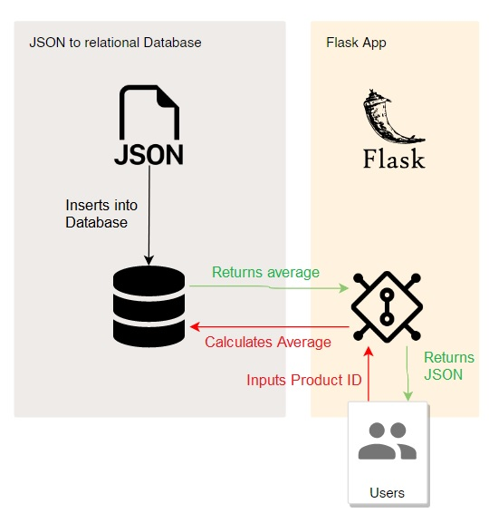

# Payload Challenge
## How is it structured?
This Flask App contains two functionalities:
1) Source payload JSON-data and write it into a database
2) Build an app, which returns a 60-day average price of a requested product-id

It is available in a simple UI on heroku: \
https://pricing-payload.herokuapp.com/

## How do I use it?
### UI request
You can type in the product ID that you want to request within the form in the UI
https://pricing-payload.herokuapp.com/

### HTTP request
Alternatively you can do a HTTP-request by just inserting the product-id to the end of the link:
e.g. https://pricing-payload.herokuapp.com/16578397

## Output
The request output is in a JSON structure. You will have 3 values:
1) `product_found`: Boolean, which tells you, whether your product-id is within the database
2) `product_id`: The product-id that you requested
3) `sixty_day_average_price_euro`: The mean of all prices of this product-id within the last 60 days

## Potential
- There is no data validation in it yet. Especially prices can be checked by limiting to only positive values.
- Null values for the price are dropped. There are other methods like inserting means of the column. 
 Depending on the use-case, this would need to be discussed
- The JSON data could be uploaded dynamically if the file is no static input. A fully automatic data-pipeline could be 
built.
- I used Pandas to read the data, as I expected to always have small JSON data sets. For big data, I would consider 
alternative frameworks.
